# Tutorial Instalasi Pada Windows

Sebelum install Git di Windows, anda harus sudah mempunyai editor teks yang didukung oleh Windws. Editor yang bisa dipilih banyak, tetapi disarankan menggunakan [Notepad++](https://notepad-plus-plus.org/) atau [Visual Studion Code](https://code.visualstudio.com/) atau [Vim](https://www.vim.org/). Keberadaan editor teks ini akan menentukan keberhasilan instalasi (lihat langkah 5).

1. Setelah *download* Git, *double click* pada *file* yang di-**download*. Akan dimunculkan lisensi. Klik **Next** untuk lanjut.

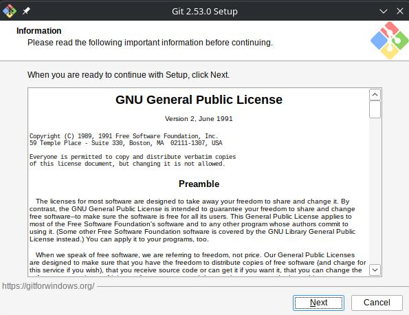

2. Setelah itu, pilih lokasi instalasi. Secara *default* akan terisi *C:\Program Files\Git*. Ganti lokasi jika memang anda menginginkan lokasi lain, klik **Next**.

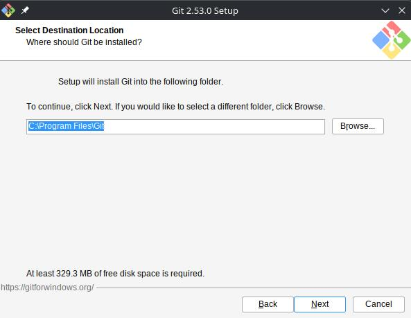

3. Pilih komponen. Tidak perlu diubah-ubah, sesuai dengan *default* saja. Klik pada **Next**.

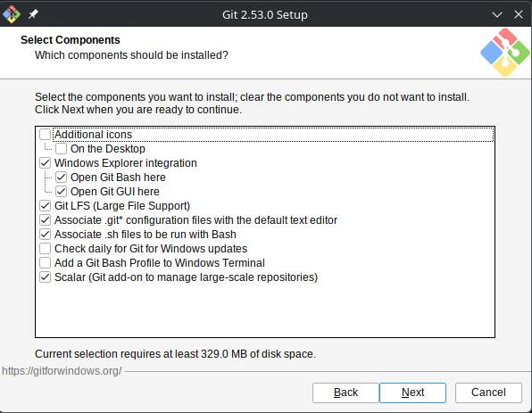

4. Mengisi *shortcut* untuk menu Start. Gunakan *default* (Git), ganti jika ingin mengganti - misalnya Git VCS.

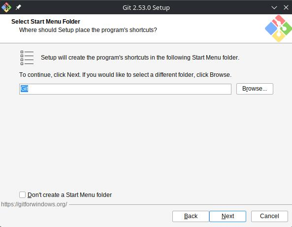

5. Pilih editor yang akan digunakan bersama dengan Git. Pada dasarnya anda bebas menggunakan editor teks apapun. 

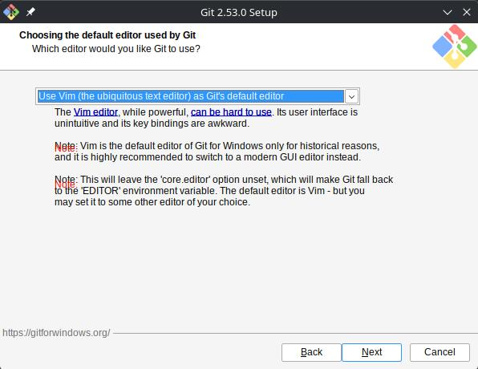

Beberapa editor teks yang bisa anda gunakan adalah:

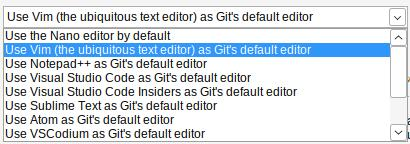

Anda juga bisa menggunakan editor pilihan anda sendiri selain di daftar dengan memilih pilihan terakhir dan kemudian mengisikan *executable file* dari editor teks yang akan digunakan.

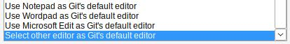

6. Setiap melakukan inisialisasi repo Git, suatu nama **branch** akan diberikan. *Default* nama adalah **master** tetapi umumnya sekarang diganti dengan **main**. Ubahlah konfigurasi tersebut:

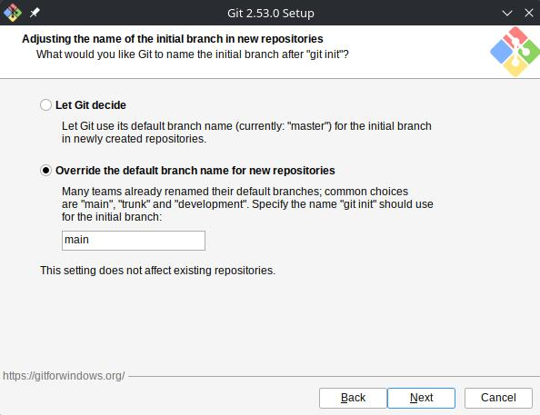

7. Pada saat instalasi, Git menyediakan akses git melalui Bash maupun *command prompt*. Pilih pilihan kedua supaya bisa menggunakan dari dua antarmuka tersebut. Bash adalah shell di Linux. Penggunaan bash di Windows memungkinkan pekerjaan di command line Windows bisa dilakukan menggunakan bash - termasuk ekskusi dari Git.

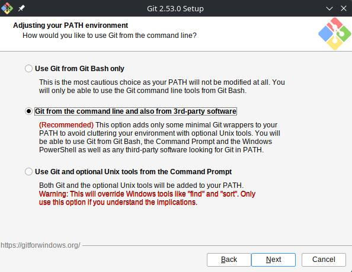

8. Pilih **native Windows Secure Channel library** HTTPS. Git menggunakan https untuk akses ke repo GitHub atau repo-repo lain (GitLab, Assembla).

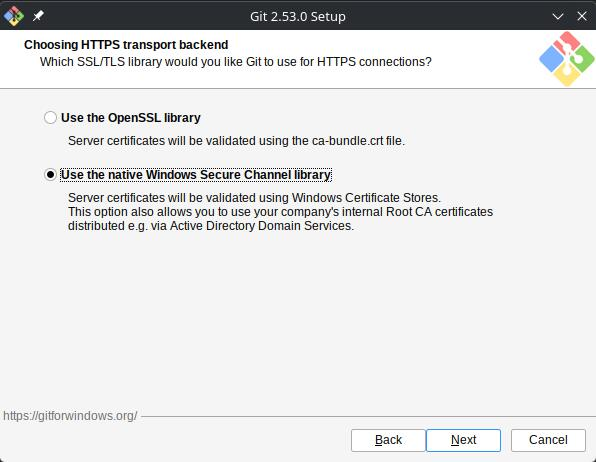

9. Pilih pilihan pertama untuk konversi akhir baris (CR-LF).

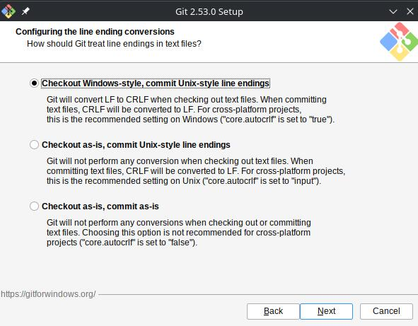

10. Pilih MinTTY untuk terminal yang digunakan untuk mengakses Git Bash.

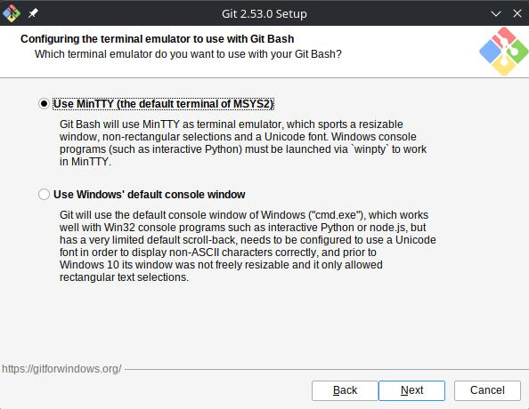

11. Tetapkan perilaku standar dari **git pull**. Pilih default saja yaitu **Fast-forward or merge**.

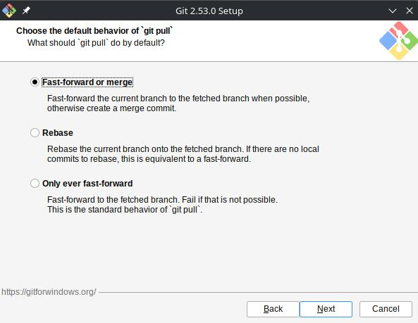

12. Memilih **credential helper**.

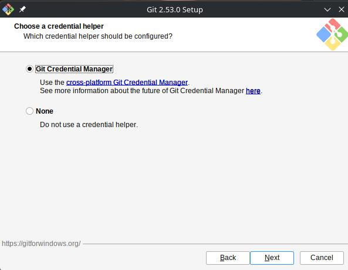

13. Untuk opsi ekstra, pilih serta aktifkan *file system caching*.

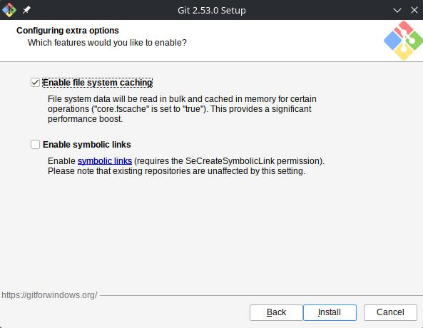

14. Setelah itu proses instalasi akan dilakukan.

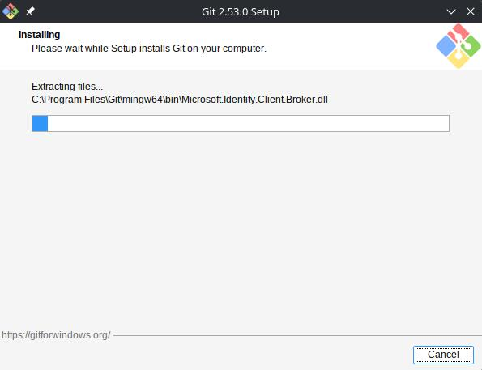

15. Jika selesai akan muncul dialog pemberitahuan. Klik pada **Finish**.

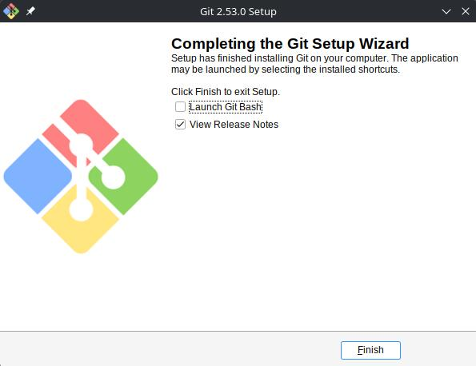

16. Untuk mencoba dari *command prompt*, masuk ke *command prompt*, setelah itu jalankan "git" untuk melihat apakah sudah terinstall atau belum. Jika sudah terinstall dengan benar, makan akan muncul hasil berikut:

```bash
C:\Program Files\Git\bin>git
usage: git [-v | --version] [-h | --help] [-C <path>] [-c <name>=<value>]
           [--exec-path[=<path>]] [--html-path] [--man-path] [--info-path]
           [-p | --paginate | -P | --no-pager] [--no-replace-objects] [--no-lazy-fetch]
           [--no-optional-locks] [--no-advice] [--bare] [--git-dir=<path>]
           [--work-tree=<path>] [--namespace=<name>] [--config-env=<name>=<envvar>]
           <command> [<args>]

These are common Git commands used in various situations:

start a working area (see also: git help tutorial)
   clone      Clone a repository into a new directory
   init       Create an empty Git repository or reinitialize an existing one

work on the current change (see also: git help everyday)
   add        Add file contents to the index
   mv         Move or rename a file, a directory, or a symlink
   restore    Restore working tree files
   rm         Remove files from the working tree and from the index

examine the history and state (see also: git help revisions)
   bisect     Use binary search to find the commit that introduced a bug
   diff       Show changes between commits, commit and working tree, etc
   grep       Print lines matching a pattern
   log        Show commit logs
   show       Show various types of objects
   status     Show the working tree status

grow, mark and tweak your common history
   backfill   Download missing objects in a partial clone
   branch     List, create, or delete branches
   commit     Record changes to the repository
   merge      Join two or more development histories together
   rebase     Reapply commits on top of another base tip
   reset      Set `HEAD` or the index to a known state
   switch     Switch branches
   tag        Create, list, delete or verify tags

collaborate (see also: git help workflows)
   fetch      Download objects and refs from another repository
   pull       Fetch from and integrate with another repository or a local branch
   push       Update remote refs along with associated objects

'git help -a' and 'git help -g' list available subcommands and some
concept guides. See 'git help <command>' or 'git help <concept>'
to read about a specific subcommand or concept.
See 'git help git' for an overview of the system.

C:\Program Files\Git\bin>
```

Lihat versi dari Git:

```bash
C:\Program Files\Git\bin>git --version
git version 2.53.0.windows.1

C:\Program Files\Git\bin>
```